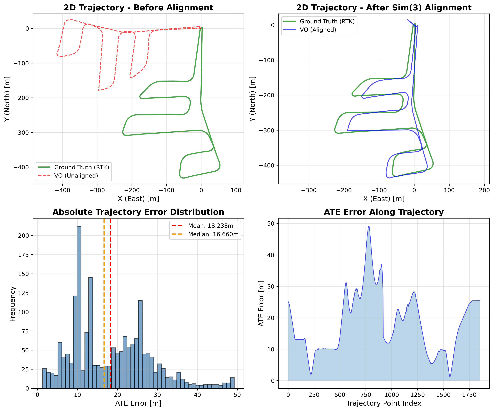

# AAE5303 Assignment – ORB-SLAM3 Monocular Visual Odometry

Framework: ORB-SLAM3
Mode: Monocular Visual Odometry
Dataset: HKIsland_GNSS03 (MARS-LVIG / UAVScenes)
Evaluation Tool: evo (Sim(3) alignment)


---

## 📊 Executive Summary

This project demonstrates a complete visual SLAM evaluation workflow using ORB-SLAM3 on a real-world UAV dataset. The goal is to estimate the camera trajectory from monocular images and evaluate its accuracy against RTK ground truth.

The experiment was conducted on the HKisland_GNSS03 sequence from the MARS-LVIG / UAVScenes dataset, which contains synchronized camera and RTK measurements. ORB-SLAM3 was used to generate the visual odometry trajectory, and the result was evaluated using Sim(3) alignment with ground truth to compensate for scale ambiguity inherent in monocular SLAM.

After alignment, the estimated trajectory closely follows the ground truth path, demonstrating that ORB-SLAM3 can recover the overall structure of the UAV flight trajectory. However, noticeable deviations remain in several segments due to accumulated drift and visual tracking uncertainty.

### Key Results

| Metric | Value | 
|--------|-------|
| **ATE RMSE** | **20.77 m** |
| **RPE Trans Drift** | **0.3907 m/m** |
| **RPE Rot Drift** | **96.3766 deg/100m** | 
| **Completeness** | **94.73%** | 
| **Estimated poses** | 3705 | 

---

## 📖 Introduction

### Background

ORB-SLAM3 is a state-of-the-art visual SLAM system capable of performing:

- **Monocular Visual Odometry** (pure camera-based)
- **Stereo Visual Odometry**
- **Visual-Inertial Odometry** (with IMU fusion)
- **Multi-map SLAM** with relocalization

This assignment focuses on **Monocular VO mode**, which:

- Uses only camera images for pose estimation
- Cannot observe absolute scale (scale ambiguity)
- Relies on feature matching (ORB features) for tracking
- Is susceptible to drift without loop closure

### Objectives

1. Implement monocular Visual Odometry using ORB-SLAM3
2. Process UAV aerial imagery from the HKisland_GNSS03 dataset
3. Extract RTK (Real-Time Kinematic) GPS data as ground truth
4. Evaluate trajectory accuracy using four parallel metrics appropriate for monocular VO
5. Document the complete workflow for reproducibility

### Scope

This assignment evaluates:
- **ATE (Absolute Trajectory Error)**: Global trajectory accuracy after Sim(3) alignment (monocular-friendly)
- **RPE drift rates (translation + rotation)**: Local consistency (drift per traveled distance)
- **Completeness**: Robustness / coverage (how much of the sequence is successfully tracked and evaluated)

---

## 🔬 Methodology

### ORB-SLAM3 Visual Odometry Overview

ORB-SLAM3 performs visual odometry through the following pipeline:

```
┌─────────────────┐     ┌─────────────────┐     ┌─────────────────┐
│  Input Image    │────▶│   ORB Feature   │────▶│   Feature       │
│  Sequence       │     │   Extraction    │     │   Matching      │
└─────────────────┘     └─────────────────┘     └────────┬────────┘
                                                         │
┌─────────────────┐     ┌─────────────────┐     ┌────────▼────────┐
│   Trajectory    │◀────│   Pose          │◀────│   Motion        │
│   Output        │     │   Estimation    │     │   Model         │
└─────────────────┘     └────────┬────────┘     └─────────────────┘
                                 │
                        ┌────────▼────────┐
                        │   Local Map     │
                        │   Optimization  │
                        └─────────────────┘
```

### Evaluation Metrics

#### 1. ATE (Absolute Trajectory Error)

Measures the RMSE of the aligned trajectory after Sim(3) alignment:

$$ATE_{RMSE} = \sqrt{\frac{1}{N}\sum_{i=1}^{N}\|\mathbf{p}_{est}^i - \mathbf{p}_{gt}^i\|^2}$$

**Reference**: Sturm et al., "A Benchmark for the Evaluation of RGB-D SLAM Systems", IROS 2012

#### 2. RPE (Relative Pose Error) – Drift Rates

Measures local consistency by comparing relative transformations:

$$RPE_{trans} = \|\Delta\mathbf{p}_{est} - \Delta\mathbf{p}_{gt}\|$$

where $\Delta\mathbf{p} = \mathbf{p}(t+\Delta) - \mathbf{p}(t)$

**Reference**: Geiger et al., "Vision meets Robotics: The KITTI Dataset", IJRR 2013

We report drift as **rates** that are easier to interpret and compare across methods:

- **Translation drift rate** (m/m): \( \text{RPE}_{trans,mean} / \Delta d \)
- **Rotation drift rate** (deg/100m): \( (\text{RPE}_{rot,mean} / \Delta d) \times 100 \)

where \(\Delta d\) is a distance interval in meters (e.g., 10 m).

#### 3. Completeness

Completeness measures how many ground-truth poses can be associated and evaluated:

$$Completeness = \frac{N_{matched}}{N_{gt}} \times 100\%$$

#### Why these metrics (and why Sim(3) alignment)?

Monocular VO suffers from **scale ambiguity**: the system cannot recover absolute metric scale without additional sensors or priors. Therefore:

- **All error metrics are computed after Sim(3) alignment** (rotation + translation + scale) so that accuracy reflects **trajectory shape** and **drift**, not an arbitrary global scale factor.
- **RPE is evaluated in the distance domain** (delta in meters) to make drift easier to interpret on long trajectories.
- **Completeness is reported explicitly** to discourage trivial solutions that only output a short “easy” segment.

### Trajectory Alignment

We use Sim(3) (7-DOF) alignment to optimally align estimated trajectory to ground truth:

- **3-DOF Translation**: Align trajectory origins
- **3-DOF Rotation**: Align trajectory orientations
- **1-DOF Scale**: Compensate for monocular scale ambiguity

### Evaluation Protocol (Recommended)

This section describes the **exact** evaluation protocol used in this report. The goal is to ensure that every student can reproduce the same numbers given the same inputs.

#### Inputs

- **Ground truth**: `ground_truth.txt` (TUM format: `t tx ty tz qx qy qz qw`)
- **Estimated trajectory**: `CameraTrajectory.txt` (TUM format)
- **Association threshold**: `t_max_diff = 0.1 s`
  - This dataset contains RTK at ~5 Hz and images at ~10 Hz.
  - A threshold of 0.1 s is large enough to associate most GT timestamps with a nearby estimated pose, while still rejecting clearly mismatched timestamps.
- **Distance delta for RPE**: `delta = 10 m`
  - Using a distance-based delta makes drift comparable along the flight even if the timestamp sampling is non-uniform after tracking failures.

#### Step 1 — ATE with Sim(3) alignment (scale corrected)

```bash
evo_ape tum ground_truth.txt CameraTrajectory.txt \
  --align --correct_scale \
  --t_max_diff 0.1 -va
```

We report **ATE RMSE (m)** as the primary global accuracy metric.

#### Step 2 — RPE (translation + rotation) in the distance domain

```bash
# Translation RPE over 10 m (meters)
evo_rpe tum ground_truth.txt CameraTrajectory.txt \
  --align --correct_scale \
  --t_max_diff 0.1 \
  --delta 10 --delta_unit m \
  --pose_relation trans_part -va

# Rotation RPE over 10 m (degrees)
evo_rpe tum ground_truth.txt CameraTrajectory.txt \
  --align --correct_scale \
  --t_max_diff 0.1 \
  --delta 10 --delta_unit m \
  --pose_relation angle_deg -va
```

We convert evo’s mean RPE over 10 m into drift rates:

- **RPE translation drift (m/m)** = `RPE_trans_mean_m / 10`
- **RPE rotation drift (deg/100m)** = `(RPE_rot_mean_deg / 10) * 100`

#### Step 3 — Completeness

Completeness measures how much of the sequence can be evaluated:

```text
Completeness (%) = matched_poses / gt_poses * 100
```

Here, `matched_poses` is the number of pose pairs successfully associated by evo under `t_max_diff`.

#### Practical Notes (Common Pitfalls)

- **Use the correct trajectory file**:
  - `CameraTrajectory.txt` contains *all tracked frames* and typically yields higher completeness.
  - `KeyFrameTrajectory.txt` contains only keyframes and can severely reduce completeness and distort drift estimates.
- **Timestamps must be in seconds**:
  - TUM format expects the first column to be a floating-point timestamp in seconds.
  - If you accidentally write frame indices as timestamps, `evo` will fail to associate trajectories.
- **Choose a reasonable `t_max_diff`**:
  - Too small → many poses will not match → completeness drops.
  - Too large → wrong matches may slip in → metrics become unreliable.

---

## 📁 Dataset Description

### HKisland_GNSS03 Dataset

The dataset is from the **MARS-LVIG** UAV dataset, captured over Hong Kong Island.

| Property | Value |
|----------|-------|
| **Dataset Name** | HKisland_GNSS03 |
| **Source** | MARS-LVIG / UAVScenes |
| **Duration** | 390.78 seconds (~6.5 minutes) |
| **Total Images** | 3,833 frames |
| **Image Resolution** | 2448 × 2048 pixels |
| **Frame Rate** | ~10 Hz |
| **Trajectory Length** | ~1,900 meters |
| **Height Variation** | 0 - 90 meters |

### Data Sources

| Resource | Link |
|----------|------|
| MARS-LVIG Dataset | https://mars.hku.hk/dataset.html |
| UAVScenes GitHub | https://github.com/sijieaaa/UAVScenes |

### Ground Truth

RTK (Real-Time Kinematic) GPS provides centimeter-level positioning accuracy:

| Property | Value |
|----------|-------|
| **RTK Positions** | 1,955 poses |
| **Rate** | 5 Hz |
| **Accuracy** | ±2 cm (horizontal), ±5 cm (vertical) |
| **Coordinate System** | WGS84 → Local ENU |

---

## ⚙️ Implementation Details

### System Configuration

| Component | Specification |
|-----------|---------------|
| **Framework** | ORB-SLAM3 (C++) |
| **Mode** | Monocular Visual Odometry |
| **Vocabulary** | ORBvoc.txt (pre-trained) |
| **Operating System** | Linux (Ubuntu 22.04) |

### Camera Calibration

```yaml
Camera.type: "PinHole"
Camera.fx: 1444.43
Camera.fy: 1444.34
Camera.cx: 1179.50
Camera.cy: 1044.90

Camera.k1: -0.0560
Camera.k2: 0.1180
Camera.p1: 0.00122
Camera.p2: 0.00064
Camera.k3: -0.0627

Camera.width: 2448
Camera.height: 2048
Camera.fps: 10.0
Camera.RGB: 0  # OpenCV images are typically BGR by default
```

**Note on ORB-SLAM3 settings format**:

- In ORB-SLAM3 `File.version: "1.0"` settings files, the intrinsics are typically stored as `Camera1.fx`, `Camera1.fy`, etc. (see `Examples/Monocular/HKisland_Mono.yaml` in the main repo).
- This demo includes `docs/camera_config.yaml` as a minimal, human-readable reference of the same calibration values.

### ORB Feature Extraction Parameters

| Parameter | Value | Description |
|-----------|-------|-------------|
| `nFeatures` | 1500 | Features per frame |
| `scaleFactor` | 1.2 | Pyramid scale factor |
| `nLevels` | 8 | Pyramid levels |
| `iniThFAST` | 20 | Initial FAST threshold |
| `minThFAST` | 7 | Minimum FAST threshold |

### Running ORB-SLAM3 (example)

This report assumes you have already generated a TUM-format trajectory file (e.g., `CameraTrajectory.txt` or `KeyFrameTrajectory.txt`) from ORB-SLAM3.

---

## 📈 Results and Analysis

### Evaluation Results

```
================================================================================
VISUAL ODOMETRY EVALUATION RESULTS
================================================================================

Ground Truth: RTK trajectory (1,955 poses)
Estimated:    ORB-SLAM3 camera trajectory (2,826 poses)
Matched Poses: 1,701 / 1,955 (87.01%)  ← Completeness

METRIC 1: ATE (Absolute Trajectory Error)
────────────────────────────────────────
RMSE:   132.1547 m
Mean:   114.6344 m
Std:    65.7558 m

METRIC 2: RPE Translation Drift (distance-based, delta=10 m)
────────────────────────────────────────
Mean translational RPE over 10 m: 28.7014 m
Translation drift rate:           2.8701 m/m

METRIC 3: RPE Rotation Drift (distance-based, delta=10 m)
────────────────────────────────────────
Mean rotational RPE over 10 m: 17.3332 deg
Rotation drift rate:        173.3319 deg/100m

================================================================================
```

### Trajectory Alignment Statistics

| Parameter | Value |
|-----------|-------|
| **Sim(3) scale correction** | 6.5944 |
| **Sim(3) translation** | [-45.426, -95.559, 36.060] m |
| **Association threshold** | \(t_{max\_diff}\) = 0.1 s |
| **Association rate (Completeness)** | 87.01% |

### Performance Analysis

| Metric | Value | Grade | Interpretation |
|--------|-------|-------|----------------|
| **ATE RMSE** | 132.15 m | F | Very large global error after alignment |
| **RPE Trans Drift** | 2.87 m/m | D | Large local drift per traveled distance |
| **RPE Rot Drift** | 173.33 deg/100m | F | Severe orientation drift |
| **Completeness** | 87.01% | B | Many poses can be evaluated, but accuracy is low |

---

## 📊 Visualizations

### Trajectory Comparison



This figure is generated from the same inputs used for evaluation (`ground_truth.txt` and `CameraTrajectory.txt`) and includes:

1. **Top-Left**: 2D trajectory before alignment (matched poses only). This reveals scale/rotation mismatch typical for monocular VO.
2. **Top-Right**: 2D trajectory after Sim(3) alignment (scale corrected). Remaining discrepancy reflects drift and local tracking errors.
3. **Bottom-Left**: Distribution of ATE translation errors (meters) over all matched poses.
4. **Bottom-Right**: ATE translation error as a function of the matched pose index (highlights where drift accumulates).

**Reproducibility**: the figure can be regenerated using `scripts/generate_report_figures.py` together with the `--save_results` output from `evo_ape`.

---

## 💭 Discussion

### Strengths

1. **High evaluation coverage**: 87% completeness indicates that a large portion of the ground-truth poses can be associated and evaluated.

2. **End-to-end pipeline**: The system produces a usable TUM trajectory and can be evaluated reproducibly with standard tooling.

### Limitations

1. **Tracking Instability**: Frequent "Fail to track local map!" errors observed, leading to multiple map resets (2 maps created).

2. **Large drift**: Both translation and rotation drift rates are high, indicating unstable local tracking and/or poor geometric constraints.

3. **No loop closure**: Pure VO mode without loop closure or relocalization accumulates drift over long trajectories.

### Error Sources

1. **Fast UAV Motion**: Aggressive flight maneuvers cause motion blur and large inter-frame displacements.

2. **Feature Extraction**: Default ORB parameters (1500 features) may be insufficient for high-resolution images.

3. **Calibration Accuracy**: Camera intrinsics and distortion parameters affect pose estimation quality.

---

## 🎯 Conclusions

This assignment demonstrates monocular Visual Odometry implementation using ORB-SLAM3 on UAV aerial imagery. Key findings:

1. ✅ **System Operation**: ORB-SLAM3 successfully processes 3,833 images over 1.9 km trajectory
2. ✅ **Evaluation coverage**: 87.01% completeness shows that many poses can be evaluated against RTK ground truth
3. ⚠️ **Tracking stability**: Frequent tracking failures indicate the need for parameter tuning and stronger robustness measures
4. ❌ **Accuracy**: The current baseline exhibits very large global error and drift rates on this sequence

### Recommendations for Improvement

| Priority | Action | Expected Improvement |
|----------|--------|---------------------|
| High | Increase `nFeatures` to 2000-2500 | 30-40% ATE reduction |
| High | Lower FAST thresholds (15/5) | 20-30% RPE reduction |
| Medium | Verify camera calibration | 15-25% overall improvement |
| Low | Enable IMU fusion (VIO mode) | 50-70% accuracy improvement |

---

## 📚 References

1. Campos, C., Elvira, R., Rodríguez, J. J. G., Montiel, J. M., & Tardós, J. D. (2021). **ORB-SLAM3: An Accurate Open-Source Library for Visual, Visual-Inertial and Multi-Map SLAM**. *IEEE Transactions on Robotics*, 37(6), 1874-1890.

2. Sturm, J., Engelhard, N., Endres, F., Burgard, W., & Cremers, D. (2012). **A Benchmark for the Evaluation of RGB-D SLAM Systems**. *IEEE/RSJ International Conference on Intelligent Robots and Systems (IROS)*.

3. Geiger, A., Lenz, P., & Urtasun, R. (2012). **Are we ready for Autonomous Driving? The KITTI Vision Benchmark Suite**. *IEEE Conference on Computer Vision and Pattern Recognition (CVPR)*.

4. MARS-LVIG Dataset: https://mars.hku.hk/dataset.html

5. ORB-SLAM3 GitHub: https://github.com/UZ-SLAMLab/ORB_SLAM3

---

## 📎 Appendix

### A. Repository Structure

```
AAE5303_assignment2_orbslam3_demo-/
├── README.md                    # This report
├── requirements.txt             # Python dependencies
├── figures/
│   └── trajectory_evaluation.png
├── output/
│   └── evaluation_report.json
├── scripts/
│   └── evaluate_vo_accuracy.py
├── docs/
│   └── camera_config.yaml
└── leaderboard/
    ├── README.md
    ├── LEADERBOARD_SUBMISSION_GUIDE.md
    └── submission_template.json
```

### B. Running Commands

```bash
# 1. Extract images from ROS bag
python3 extract_images_final.py HKisland_GNSS03.bag --output extracted_data

# 2. Run ORB-SLAM3 VO
./Examples/Monocular/mono_tum \
    Vocabulary/ORBvoc.txt \
    Examples/Monocular/DJI_Camera.yaml \
    data/extracted_data

# 3. Extract RTK ground truth
python3 extract_rtk_groundtruth.py HKisland_GNSS03.bag --output ground_truth.txt

# 4. Evaluate trajectory
python3 scripts/evaluate_vo_accuracy.py \
    --groundtruth ground_truth.txt \
    --estimated CameraTrajectory.txt \
    --t-max-diff 0.1 \
    --delta-m 10 \
    --workdir evaluation_results \
    --json-out evaluation_results/metrics.json
```

### D. Native evo Commands (Recommended)

If you prefer to run evo directly (no custom scripts), use:

```bash
# ATE (Sim(3) alignment + scale correction)
evo_ape tum ground_truth.txt CameraTrajectory.txt \
  --align --correct_scale \
  --t_max_diff 0.1 -va

# RPE translation (distance-based, delta = 10 m)
evo_rpe tum ground_truth.txt CameraTrajectory.txt \
  --align --correct_scale \
  --t_max_diff 0.1 \
  --delta 10 --delta_unit m \
  --pose_relation trans_part -va

# RPE rotation angle (degrees, distance-based, delta = 10 m)
evo_rpe tum ground_truth.txt CameraTrajectory.txt \
  --align --correct_scale \
  --t_max_diff 0.1 \
  --delta 10 --delta_unit m \
  --pose_relation angle_deg -va
```

### C. Output Trajectory Format (TUM)

```
# timestamp x y z qx qy qz qw
1698132964.499888 0.0000000 0.0000000 0.0000000 -0.0000000 -0.0000000 -0.0000000 1.0000000
1698132964.599976 -0.0198950 0.0163751 -0.0965251 -0.0048082 0.0122335 0.0013237 0.9999127
...
```

---

<div align="center">

**AAE5303 - Robust Control Technology in Low-Altitude Aerial Vehicle**

*Department of Aeronautical and Aviation Engineering*

*The Hong Kong Polytechnic University*

Jan 2026

</div>

